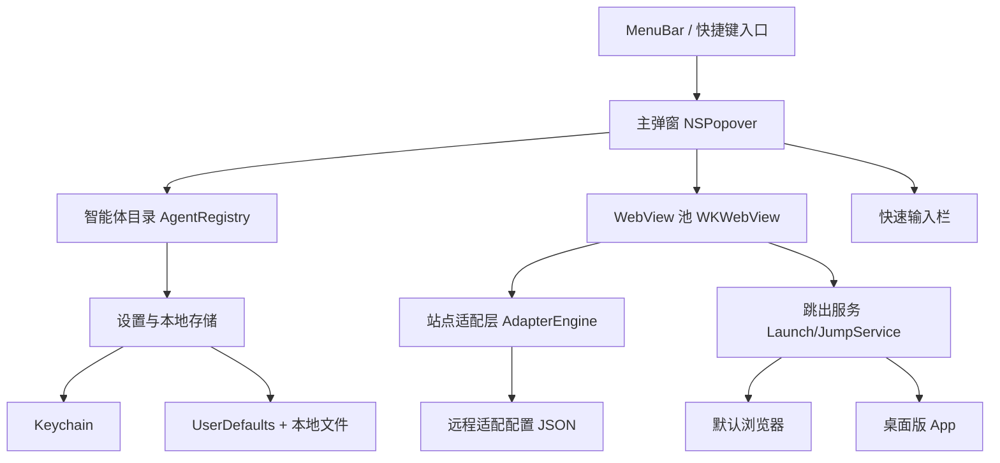

# AI 快速入口 · macOS 菜单栏应用设计文档

## 1. 产品定位

一句话定位：菜单栏常驻的 AI 智能体集合入口，一次提问、多端对比、一键跳出到完整网页或桌面端。

目标用户：高频使用多个 AI 工具的人，包括开发者、研究者、内容创作者和普通办公用户。

核心价值：

1. 更快：不用在 Dock、浏览器书签、标签页之间切换，快捷键或菜单栏点击即可唤起。
2. 更省：保留每个站点自己的登录态，不需要在 App 里重复登录。
3. 更全：同一个问题可以同时发给多个智能体，快速比较不同答案。
4. 更稳：嵌入浏览器能力有限时，一键跳到原站网页版、桌面版或官网补齐完整功能。

### MVP 简化范围

第一版只做主流程：菜单栏弹窗、左侧选择智能体、右侧嵌入网页端、底部一次输入、同问对比、本地知识库（对话归档 + 搜索）、跳出到浏览器/桌面版/官网。历史记录、问题模板、远程配置、自动更新放到主流程跑通之后再补。

## 2. 核心功能

### 2.1 菜单栏与弹窗

- 菜单栏常驻一个应用图标（可自定义图标），点击弹出主窗口。
- 弹窗尺寸约 1000 × 700，支持手动缩放，深浅色模式适配。
- 支持全局快捷键唤起弹窗（例如 `⌥ Space`）。
- 应用以 `LSUIElement` 方式运行，不占 Dock 图标，可通过菜单项打开设置。

### 2.2 智能体目录

首批建议支持：

| 智能体 | 网页端 | 备注 |
|---|---|---|
| ChatGPT | chatgpt.com | 重点适配 |
| Claude | claude.ai | 重点适配 |
| Gemini | gemini.google.com | 重点适配 |
| DeepSeek | chat.deepseek.com | 国内可用 |
| Kimi | kimi.moonshot.cn | 国内可用 |
| 豆包 | doubao.com | 国内可用 |
| 腾讯元宝 | yuanbao.tencent.com | 国内可用 |
| 通义 | tongyi.aliyun.com | 国内可用 |
| 智谱清言 | chatglm.cn | 国内可用 |
| Grok | grok.com | 重点适配 |
| Perplexity | perplexity.ai | 可选 |
| Copilot | copilot.microsoft.com | 可选 |

每个智能体在配置中保存：

- 显示名称、官方 Logo、主题色。
- 聊天页 URL、官网 URL。
- 输入框/发送按钮的 DOM 适配信息（见 3.4）。
- 桌面版 App 名称、Bundle ID、URL Scheme（存在时）。
- 登录状态检测规则。

智能体目录支持后台管理：增删智能体、启停显示、编辑名称和网页地址；常用智能体可以置顶，并通过上移/下移或拖拽调整顺序，排序结果本地持久化。

### 2.3 单聊模式

- 点击左侧智能体，右侧 WebView 直接打开该智能体网页端。
- 使用持久化 Cookie/网站数据，登录一次后长期有效。
- 底部快速输入框可向当前智能体发送消息，发送动作按站点适配层执行。

### 2.4 多智能体同问模式（广播）

- 左侧每个智能体可勾选，支持保存常用分组（例如“默认组”“国内组”）。
- 输入一个问题，点击发送，按组内顺序依次发送给所有勾选的智能体。
- 每个智能体拥有独立的对话框和独立 WebView，回答只保留在各自对话里。
- 点击左侧智能体切换查看对应对话框，互不覆盖。
- 发送状态实时显示：未发送 / 发送中 / 已发送 / 已回复 / 需要人工确认。
- 不在当前查看的对话框产生新回复时，左侧菜单对应项显示小红点，点击后清除。

### 2.5 跳出到外部

每个智能体提供下拉操作：

- 在浏览器打开：使用默认浏览器打开该聊天页，并尝试带当前问题 URL 参数或自动粘贴。
- 打开桌面版：检测本地是否安装了对应 App，已安装则唤起，未安装则提示并跳转官网。
- 打开官网：打开该智能体官网。

### 2.6 其他辅助功能

- 最近对话历史：只记录本地提问时间、问题文本和发送目标，不抓取回答正文。
- 问题模板：支持 `{问题}`、`{上下文}` 变量，方便固定提示词。
- 设置页：智能体排序/显隐、默认发送组、快捷键、弹窗尺寸、开机启动、WebView 缓存清理。
- 状态提示：每个智能体显示“已登录 / 未登录 / 站点风控中”等状态。

### 2.7 本地知识库

- 左侧提供“智能体 / 知识库”两个面板，知识库面板内有搜索框和笔记列表。
- 对话结束后可一键把当前问题与回答归档为笔记，单聊和同问对比都可以归档。
- App 自动生成标题、摘要和标签；摘要先按规则提取（问题关键词、回答首段、重要句子），后续可选接入智能体做 AI 总结。
- 笔记本地保存（JSON 或 SQLite），支持标题、正文、标签、来源的全文搜索。
- 笔记支持编辑、复制、删除；数据只保存在本机，不上传。

## 3. 关键设计决策

### 3.1 技术栈：Swift + SwiftUI + WebKit

- 原生 `MenuBarExtra` + `NSPopover`，菜单栏体验最接近系统原生。
- `WKWebView` 负责嵌入网页端。
- 最低支持 macOS 13（Ventura）；如需兼容更老系统，可用 `NSStatusItem` 方案。
- 不用 Electron/Tauri：原生方案内存占用小、常驻省电、打包体积小，弹窗动画也更流畅。

### 3.2 为什么不是 iframe

ChatGPT、Claude 等站点设置了 CSP `frame-ancestors` 或 `X-Frame-Options`，iframe 嵌入会被浏览器直接拦截。正确做法是让 `WKWebView` 直接导航到目标站点，而不是在页面上套 iframe。

### 3.3 登录态与隐私

- WebView 使用独立的持久化 `WKWebsiteDataStore`，各站点 Cookie 由 WebKit 按域名隔离。
- 登录凭据、API Key 等敏感信息只存 Keychain。
- App 不采集用户聊天内容，不上传日志；远程配置只用于更新适配器规则。
- 自动发送只操作输入框，不读取站点页面中的回答文本，回答内容留在原站。

### 3.4 自动发送适配层（技术难点）

不同站点 DOM 差异大，且页面经常改版，需要为每个智能体写一个轻量适配器：

```swift
struct AgentAdapter {
    var inputSelector: String
    var inputStrategy: InputStrategy   // textarea / contenteditable / React native setter
    var sendSelector: String
    var sendTrigger: SendTrigger       // click / Enter key / keydown event
    var loginCheckScript: String?
}
```

发送策略：

1. 优先定位输入框，通过 JavaScript 模拟原生输入事件，保证 React/Vue 输入框能正确识别。
2. 点击发送按钮；按钮不可用时尝试 `Enter` 或 `keydown`。
3. 发送后轮询检测“正在生成/停止生成”等状态，标记为已发送。
4. 对无法可靠自动化的站点，降级为“聚焦输入框 + 自动粘贴问题”，由用户按一次回车，或直接跳出到浏览器。

适配器规则建议放在远程 JSON 配置中，支持按版本热更新；配置拉取失败时使用 App 内置的本地规则。

### 3.5 多 WebView 与内存

- 同一时间最多保留 4 个活跃 WebView（可配置），超出后冻结最久未使用的页面。
- 对比模式可打开独立窗口承载多个 WebView，主弹窗保持轻量。
- 页面加载、发送任务之间相互隔离，单个站点崩溃不影响其他站点。

## 4. 界面草图

```
菜单栏：  [AI 图标]                [⚙ 设置] [退出]

主弹窗（约 1000 × 700）：
┌──────────┬───────────────────────────────────────────────┐
│ 智能体列表 │ 当前智能体网页 / 对比视图                      │
│ ───────── │                                               │
│ [✓] ChatGPT│  ┌─────────────┐  ┌─────────────┐           │
│ [✓] Claude │  │ ChatGPT     │  │ Claude      │           │
│ [ ] Gemini │  │ 正在生成…    │  │ 已发送      │           │
│ [✓] Kimi   │  └─────────────┘  └─────────────┘           │
│  ...       │                                               │
│ 发送组:     │                                               │
│ [默认组 ▾]  │                                               │
├──────────┴───────────────────────────────────────────────┤
│ 输入框：请用三个要点解释什么是 RAG             [发送给4个]  │
└──────────────────────────────────────────────────────────┘
```

交互流程：

1. 点菜单栏图标或按快捷键，弹出主窗口。
2. 左侧选择单个智能体 → 单聊模式。
3. 勾选多个智能体或选择一个发送组 → 底部输入问题 → 发送。
4. 右侧进入对比视图，可切换分栏/分页。
5. 任意智能体右上角“⋮”菜单可跳到浏览器、桌面版或官网。

## 5. 技术架构



模块划分：

- `MenuBarModule`：菜单栏图标、快捷键、弹窗生命周期。
- `CatalogModule`：智能体列表、分组、Logo、默认配置。
- `WebModule`：WebView 池、持久化登录态、页面状态回调。
- `AdapterModule`：按站点注入脚本、发送指令、状态检测。
- `BroadcastModule`：多智能体发送队列、失败重试、进度状态。
- `JumpModule`：浏览器/桌面版/官网唤起。
- `StorageModule`：本地配置、历史、Keychain。

## 6. 打包与分发

目标：做成普通用户可以双击安装的安装包。

### 6.1 签名与公证

- 需要 Apple Developer Program 账号（约 $99/年）。
- 使用 Developer ID Application 证书签名 App。
- 开启 Hardened Runtime 并完成 Apple 公证（notarization）。
- 用户双击后首次打开可通过 Gatekeeper，无需右键“打开”。
- 账号建议放到 M4 再开通：本地开发和内测不需要付费账号，Xcode 用“Sign to Run Locally”或免费 Apple ID 即可在自己的 Mac 上运行；付费账号只在需要把签名后的安装包分发给其他用户时才必须。

### 6.2 安装包形态

- 首选 `.dmg`：内含 App + Applications 快捷方式，拖动即安装。
- 也可提供 `.pkg`：写到 `/Applications`，适合企业分发和统一部署。
- 两个安装包都由公证后的 App 构建。

### 6.3 自动更新

- 使用 Sparkle 框架做自动更新。
- 需要一个可访问的下载服务器或静态托管（GitHub Releases、自有服务器、对象存储均可）。
- 更新包同样需要签名与公证。

### 6.4 分发渠道

- GitHub Releases：免费、好维护。
- 自有官网：适合收费或内测分发。
- 暂不建议上 App Store：菜单栏弹窗类应用审核限制较多，且沙盒、外部分发自由度更低。

## 7. 主要风险与对策

| 风险 | 影响 | 对策 |
|---|---|---|
| 站点改版导致自动发送失效 | 核心体验受损 | 适配器远程配置 + 版本化；失效时降级为自动聚焦粘贴 |
| 站点登录风控/验证码 | 无法自动登录 | WebView 内人工登录；提示用浏览器登录后回跳 |
| 多 WebView 内存占用高 | 常驻应用卡顿 | 活跃数量上限、页面冻结、懒加载 |
| 站点禁用 WebView（极少数） | 无法嵌入 | 该智能体降级为“打开网页”按钮 |
| 网站访问需特殊网络环境 | 部分国内用户访问困难 | 不内置代理，按用户本地网络环境自然访问 |
| 菜单栏弹窗多显示器/刘海屏适配 | 显示异常 | 弹窗位置跟随菜单栏图标，约束最大高度 |

## 8. 里程碑

| 阶段 | 内容 | 预计工期 |
|---|---|---|
| M0 原型 | 菜单栏 + 弹窗 + 1 个智能体 WebView + 登录持久化 | 2-3 天 |
| M1 MVP | 智能体目录 + 单聊 + 快速输入 + 本地设置 | 1 周 |
| M2 核心 | 多智能体广播 + 对比视图 + 发送状态 | 1-2 周 |
| M3 完整 | 跳出浏览器/桌面版/官网 + 历史 + 模板 + 快捷键 | 1 周 |
| M4 分发 | 签名、公证、DMG/PKG、Sparkle 更新 | 1-2 周（含证书申请） |
| M5 公测 | 内测反馈、适配器调优、稳定性打磨 | 持续迭代 |

## 9. 开工前需要确认的问题

1. 最低支持 macOS 版本：建议 macOS 13+，是否需要支持更老版本。
2. 首批智能体列表是否按上面的 12 个执行，是否有特别想优先支持的站点。
3. 是否收费：免费、买断还是订阅，会影响分发和许可证设计。
4. 是否已有 Apple Developer 账号和分发渠道（官网/GitHub）。
5. 是否接受远程配置机制（涉及隐私和网络策略），还是全部内置本地规则。
